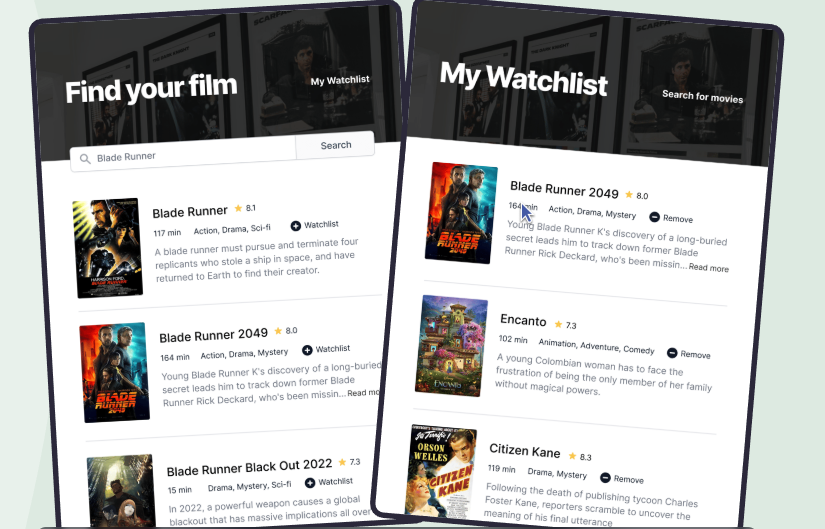

# 🌸 Movie Watchlist App  

> A simple, responsive web app that lets users search for movies, add them to a personal watchlist, and remove them when watched — all saved in localStorage.  

---

## 🪞 Overview  
This project is a web application that allows users to manage their own movie watchlist:  

- **Problem it solves:** Keeps track of movies you want to watch in one place without needing an account.  
- **Target audience:** Movie enthusiasts who want a simple, lightweight watchlist.  
- **Unique aspect:** All movies are saved locally in the browser, allowing for persistent watchlists without server-side storage.  

The app dynamically fetches movie details from the OMDb API, displays them in a clean UI, and allows users to add or remove movies easily.  

---

## 🚀 Features  
✨ Key functionality of the app:  

- 🎯 Search movies using OMDb API  
- 🧠 Add movies to a personal watchlist stored in localStorage  
- 📱 Remove movies from watchlist dynamically  
- 🌙 Explore box appears when watchlist is empty  

---

## 🧱 Tech Stack  
| Technology | Purpose |
|-------------|----------|
| **HTML5** | Structure of the app |
| **CSS3** | Styling, layout, and responsiveness |
| **JavaScript (ES6)** | Dynamic functionality, DOM manipulation, and localStorage handling |
| **OMDb API** | Fetch movie data dynamically |

---

## 📚 What We Have Studied  

Key JavaScript concepts and tools practiced while building this project:  
  

> - DOM manipulation (`querySelector`, `classList`, `innerHTML`)  
> - Event handling (`addEventListener`, click events)  
> - Working with arrays (`filter()`, `find()`, `some()`)  
> - Persistent storage with `localStorage`  
> - Async API calls with `fetch()`  

---

## 🌿 Lessons Learned  
> - Built skills in dynamic DOM updates based on user interaction  
> - Learned to manage state (watchlist) effectively using localStorage  
> - Practiced separating concerns: rendering, event handling, and storage  
> - Improved understanding of responsive UI and clean code structure  

---

## 🖼️ Screenshots / Demo  

  

🔗 **Live Demo:** [https://your-demo-link.vercel.app](https://your-demo-link.vercel.app)  

---

## 💫 Author  
👩‍💻 **Created by [Aliya](https://github.com/aliyasyeddd)**  
> _“Build. Break. Learn. Repeat.”_ 🌸
